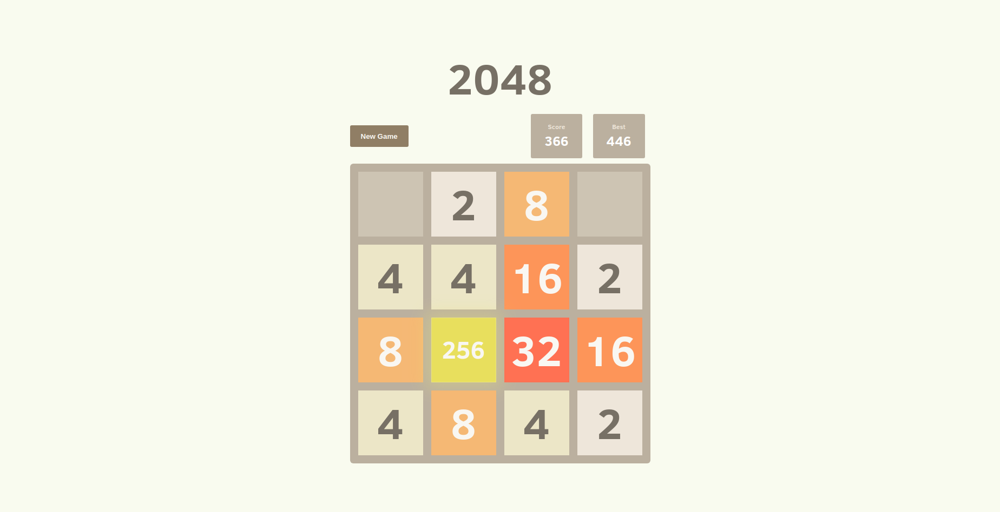

# 2048 Svelte



A project to recreate 2048 game in Svelte. The original [2048 Game](https://github.com/gabrielecirulli/2048)

## Why?

This project is part of my personal portfolio, so, I'll be happy if you could provide me any feedback about the project, code, structure or anything that you can report that could make me a better developer!

## Built With
- [Svelte JS](http://svelte.dev) - Cybernetically enhanced web apps
- [Rollup.js](https://rollupjs.org) - Module bundler
- [Postcss](https://postcss.org/) - A tool for transforming CSS with JavaScript
- [ESLint](https://eslint.org/) - Linter

## Running locally

Clone the Repository

```sh
$ git clone https://github.com/GuilhermeBohnstedt/2048-svelte.git
```

Install dependencies and start the development server

```sh
$ cd Trellu

$ yarn

$ yarn dev
```

and navigate to [localhost:5000](http://localhost:5000/)

## Contact

Email-me: - guibohnstedt@gmail.com

Connect with me at [Linkedin](https://www.linkedin.com/in/guilherme-bohnstedt-68145611a/)

## License

This project is licensed under the MIT License - see [LICENSE](https://github.com/GuilhermeBohnstedt/2048-svelte/blob/master/LICENSE) for more information.